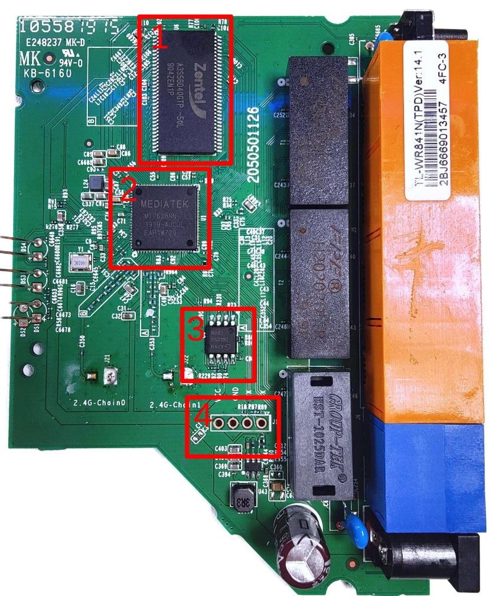
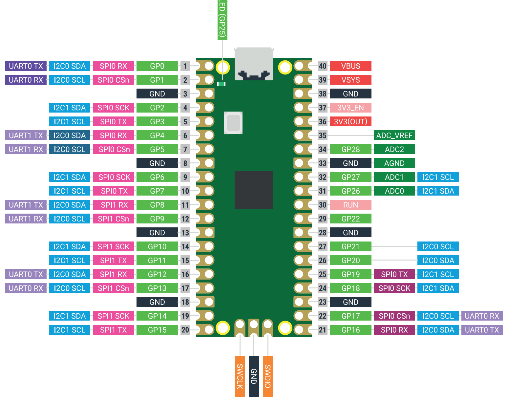

# WiFi Router Hardware Hacking Workshop

## 🚀 Welcome to the Hardware Hacking Workshop!  

We're excited to have you on board! To get the most out of the Hardware Hacking 101: The Stories IoT Devices Tell workshop, please **download the preinstalled VM** in advance:  

👉 [**Download the VM**](https://drive.google.com/file/d/1WcyIM28OBHUCk0nLIDafBUVvjXDsxDzH/view?usp=sharing)  
👉 [**Download the Router Firmware**](https://drive.google.com/file/d/1mKdtqCM44RmbPBDrKdV-rKqt4pMZDwsN/view?usp=sharing)  
🔑 The user password is: `password`  

Alternatively, you can manually install the required tools by following the instructions in **`installation.md`** in the [Workshop Repo](https://github.com/code-byter/sdc-router-hacking-workshop).  

If you have any questions or run into issues, feel free to reach out: **hello@code-byter.com**.  

Looking forward to hacking together! 🔧💡  


## Workshop Focus

This workshop is centered around the security of IoT devices, with a specific focus on:
- **Hardware security** of a WiFi router
- **Firmware analysis** and reverse engineering

## Agenda

1. **0x01: Device Recon**
   - Techniques for reconnaissance on IoT devices
2. **0x02: Firmware Extraction from Flash Memory**
   - Methods for extracting firmware from flash memory chips
3. **0x03: Extracting the Filesystem**
   - Using binwalk to extract the filesystem

## Prerequisites

- Basic knowledge of programming, networking, and memory management
- Familiarity with Linux command line
- A computer with virtualization support

## Tools and Software

- The VM / raspberry pi will include all required tools, such as:
  - **Binwalk** for firmware analysis
  - **mpremote** for  programming the raspberry pi pico
- If you prefer to set up your environment manually, a detailed list will be provided.


# Exercises


One of the first steps in hardware hacking is to conduct a visual inspection of the PCB (Printed Circuit Board). This process helps us understand how the hardware is designed, identify the components used, and determine how these components communicate with each other. In this exercise, you will examine the PCB of a router to identify key components and understand their functions.

## Exercise 0x01 - Router Inspection

In this exercise, we will inspect the router's PCB to identify crucial components and learn more about the device's design. Follow the steps below to begin.


Examine the PCB image below. Identify and document the function of each marked component.



Complete the table below with the following information for each component:

1. **Vendor**: The manufacturer of the component.
2. **Purpose**: A brief description of the component's role within the router.

| Component # | Vendor | Purpose                          |
|-------------|--------|----------------------------------|
| 1           |        |                                  |
| 2           |        |                                  |
| 3           |        |                                  |
| 4           |        |                                  |


---

## Exercise 0x02- Reading the Flash Memory

In this exercise, you will identify and research the flash memory chip used in the WiFi router. This will help you understand how data is stored and accessed within the device.

You can find more information on the Flash chip here: [Datasheet](https://www.kean.com.au/oshw/WR703N/teardown/EN25Q32B%2032Mbit%20SPI%20Flash.pdf)


Based on your findings, answer these questions:

1. **Which Flash Memory Type is Used?**
   - Determine whether the router uses NOR, NAND, or another type of flash memory. Describe its primary characteristics.

2. **Which Communication Protocol is Used?**
   - Identify the communication protocol the router uses to interface with the flash chip (e.g., SPI, I2C, parallel). This information is typically found in the datasheet.


3. **Which Command(s) Need to Be Sent to Read Data?**
   - Refer to the flash memory datasheet to determine the specific commands required to read data from the chip. Document any relevant hex codes or sequences.


In this exercise, you will write a MicroPython script to dump the contents of the flash memory chip on the router using a Raspberry Pi Pico. The goal is to extract specific data, such as the U-Boot version, from the flash chip.

### Goal

Write a MicroPython script for the Raspberry Pi Pico that connects to the flash chip and reads its contents.

### Step 1: Connect the Raspberry Pi Pico to the Flash Chip

Use the table below to connect the Raspberry Pi Pico to the flash memory chip on the router. Reference the flash chip’s datasheet for pin details to ensure correct connections.

| Flash Chip Pin | Pico Pin | Pin Description            |
|----------------|----------|----------------------------|
| CS#            |          | Chip Select                |
| DO             |          | Data Out (MISO)            |
| WP#            |          | Write Protect              |
| VSS            |          | Ground                     |
| CLK            |          | Clock                      |
| DI             |          | Data In (MOSI)             |

Ensure each connection is secure and that the power and ground lines are properly matched.

### Step 2: Send a READ Command and Dump Flash Memory

Write a MicroPython script to interface with the flash memory chip over SPI.
Your script should include commands to initialize the SPI connection, send the **READ** command, and read data from memory.

Refer to the Raspberry Pi Pico pinout below to identify the correct pins:

<p align="center">
  
</p>

### Step 3: Extract the U-Boot Version

Start reading data from address `0x0000d120`, where the U-Boot version information is stored.

### Log the U-Boot Version

Record the U-Boot version you found below:

```plaintext
U-Boot Version: [Your U-Boot Version Here]
```

---

## Exercise 0x03b - Extracting the filesystem

You can find the full flash memory dump in `firmware_dump.bin` in your team folder.
Extract the filesystem using [binwalk](https://github.com/ReFirmLabs/binwalk)


### Find the WiFi Password

Search the WiFi password in configuration files of the extracted fileystem:
Hint: Start looking at files in /etc/

```plaintext
iot{____________________}
```

---
Good luck, and happy hacking!
